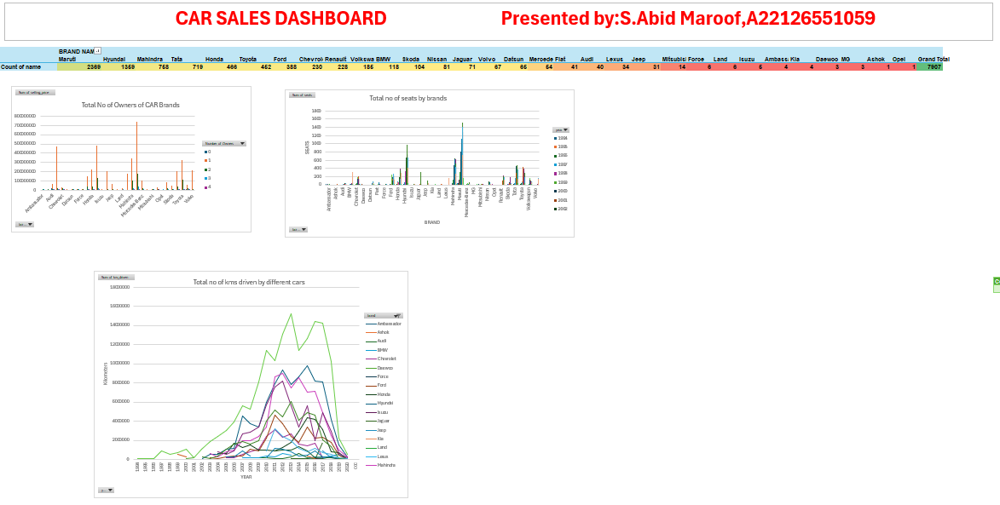

 ## CAR-sales-dashboard
This repository is for maintaining the data related to a car sales dashboard prepared using microsoft excel
Overview
This dashboard provides a comprehensive overview of car sales data. It includes information on brand-wise owners, total no of seats, and kms driven by cars.
 
* **Total No of Owners of CAR Brands:**

This bargraph likely refers to the number of cars sold by each brand that have had multiple owners. It could provide insights into the resale value and longevity of different car brands. A high number of owners for a particular brand might indicate that its cars are popular and hold their value well over time.

Conclusion: Maruti has the highest number of cars with multiple owners, suggesting that its models might be popular and hold their value well. Tata, Mahindra, and Chevrolet also have a reasonable number of cars with multiple owners, indicating their reliability and resale value.

* **Total no of seats by brands:** 

This bargraph likely shows the distribution of car seats across different brands. It could be useful for understanding the preferences of customers in terms of car size and seating capacity. For example, if a brand has a higher proportion of cars with more seats, it might indicate that it caters to larger families or groups.

Conclusion: Most of the cars in the dataset have 4 seats, indicating that they are primarily designed for individual or family use. Maruti dominates the market for 4-seater cars, while Mahindra has a significant presence in the 2-seater segment.

* **Total no of kms driven by different cars**:

This line graph likely indicates the total mileage covered by cars from each brand. It could provide insights into the durability and reliability of different car models. A high average mileage for a brand might suggest that its cars are used extensively and have a long lifespan.

Conclusion: BMW has the highest average mileage, suggesting that its cars might be used for longer distances or more frequent travel. Maruti and Tata have relatively lower average mileages, possibly indicating that their cars are used for shorter commutes or are driven less frequently.

**MY DETAILS**:
S.ABID MAROOF 

email:syedabidmaroof30@gmail.com

